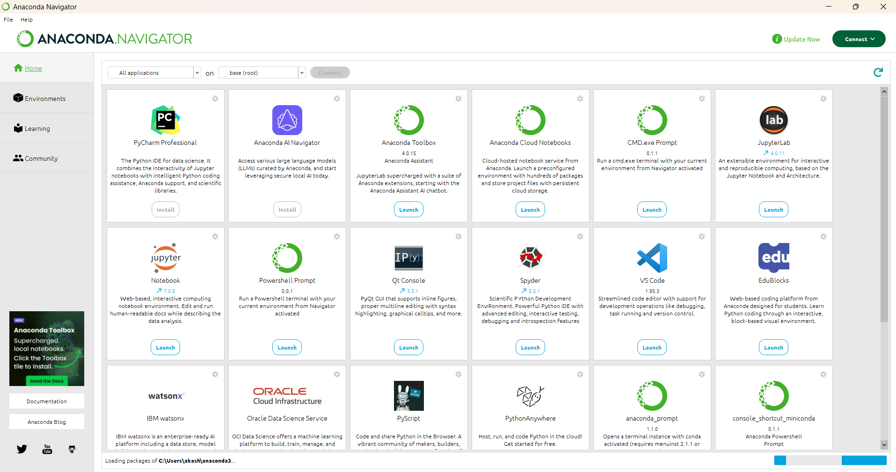
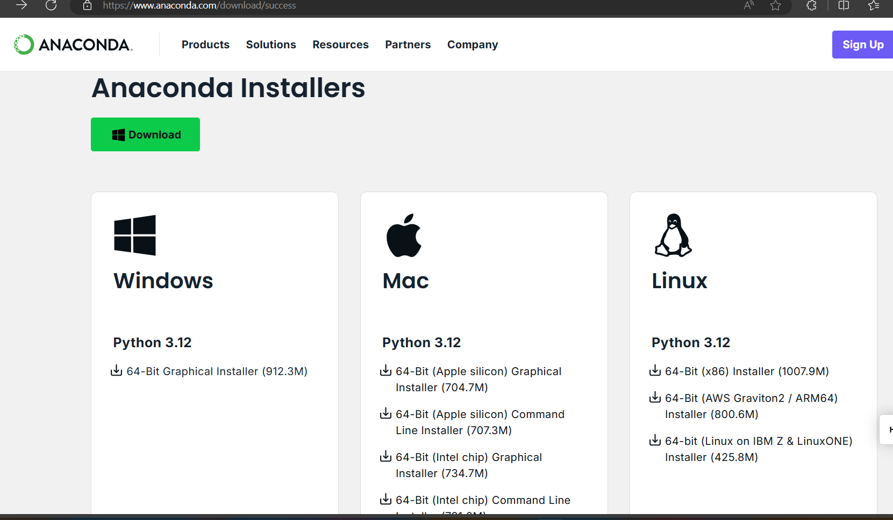
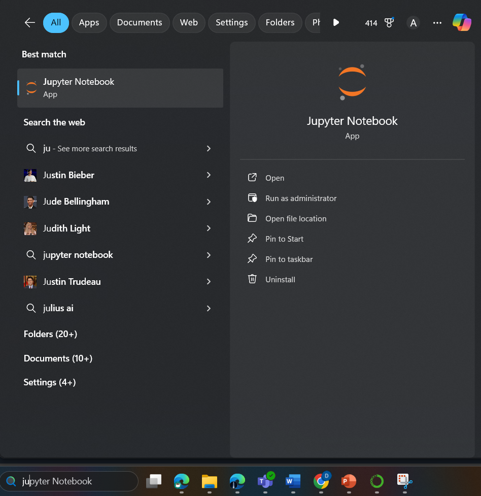

# ArtificialNeuralNetwork

One Paragraph of the project description goes here

## Getting Started

These instructions will help you get this project up and running on your local machine. It is preferred that you have basic programming knowledge (preferably in Python). See the deployment section below for instructions on how to deploy the project on a live system.

### Prerequisites

What things do you need to install the software and how to install them

```
1. GIT (Optional)
2. ANACONDA NAVIGATOR
3. DATASET TO RUN THE NEURAL NETWORK ALGORITHM
```

### Installing

A step-by-step series of examples that tell you how to get the environment running


1. Go to the website https://www.anaconda.com/download/success
2. Download the installer package corresponding to your Operating System( Windows, Linux, MacOS)

3. Once downloaded, install the software.
4. Open the Anaconda application by searching from your system's search box and click on jupyter notebook from the list of options.

5. Alternatively, you can directly search for Jupyter Notebook on your system's search box and click on open



## Running the code

1. Clone the repository using ```git clone "the web URL"``` which can be accessed by clicking the code dropdown button.
2. If Git is not installed on your system, the user can opt for the download zip option.
3. On the Jupyter Notebook opened in your browser, go to the cloned/downloaded folder and click the Assignment4.ipynb file.
4. Execute each block of code by pressing shift + enter or pressing the play button on the bar.

## Contributing

Contributions from the community are welcome! If you'd like to contribute to this project, please follow these guidelines:

1. Fork this repository.
2. Create a new branch for your contribution.
3. Make your changes and improvements.
4. Test your changes thoroughly.
5. Create a pull request (PR) with a clear description of your contribution.

## Versioning

We use [SemVer](http://semver.org/) for versioning.

## Authors

* **Anush Kumar**

## License

This project is licensed under the MIT License - see the [LICENSE.md](LICENSE.md) file for details

## Acknowledgments

* Hat tip to anyone whose code was used
* Inspiration
* etc
